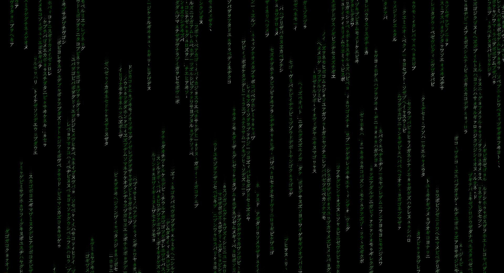
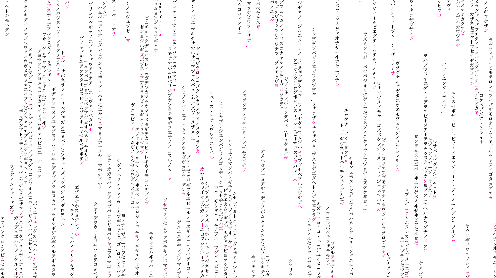

# The Matrix Console Screen

Simple simulation of the classic matrix screen.
 This is still very very unoptimized and quite slow, might move to direct opengl implementation
 
 - Added support for higher refresh rate monitors
 - Removed all allocations in the render loop
 - Updated/Refreshed the code a bit
 - Added a simple file config option

## Config file
### Properties:
    [int] CharSiz			        Symbol/Char size
    [int] VerticalSync		        Vsync on/off (1/0)
    [int] FrameRate			        Lock the frame rate, 0 for off
    [float] MinSymbolDuration	        Mininum time for the lifespan of a symbol 
    [float] MaxSymbolDuration 	        Maximum time for the lifespan of a symbol 
    [int] MinLineSymbolCount	        Minimum ammount of symbols on a vertical line
    [int] MaxLineSymbolCount	        Maximum ammount of symbols on a vertical line
    [float] MinFallSpeed		        Minimum symbol fall speed 
    [float] MaxFallSpeed                    Maximum symbol fall speed
    [int] TimeStep                          TimeStep is used to incremenet the lifespan of a char untill
    [int, int, int] BackgroundColor
    [int, int, int] TextColor
    [int, int, int] ActiveTextColor
    
### Example
    VerticalSync = 0
    CharSize = 18
    TextColor = 0, 0, 0
    BackgroundColor = 255, 255, 255
    ActiveTextColor = 255, 0, 150
    TimeStep = 10
    MinSymbolDuration = 10
    MaxSymbolDuration = 200
    MinLineSymbolCount = 10
    MaxLineSymbolCount = 50

Which would produce:

